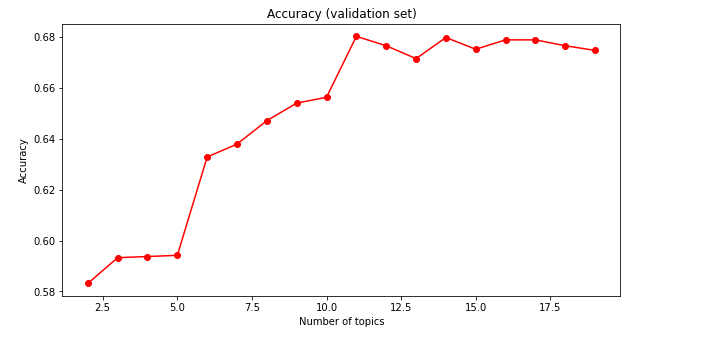
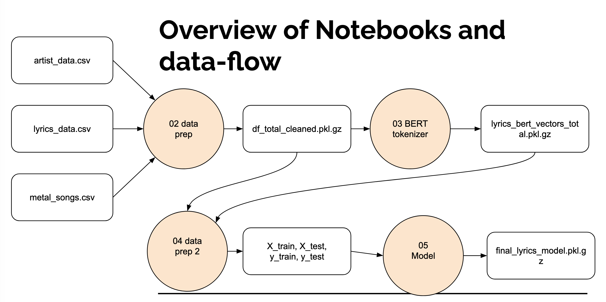
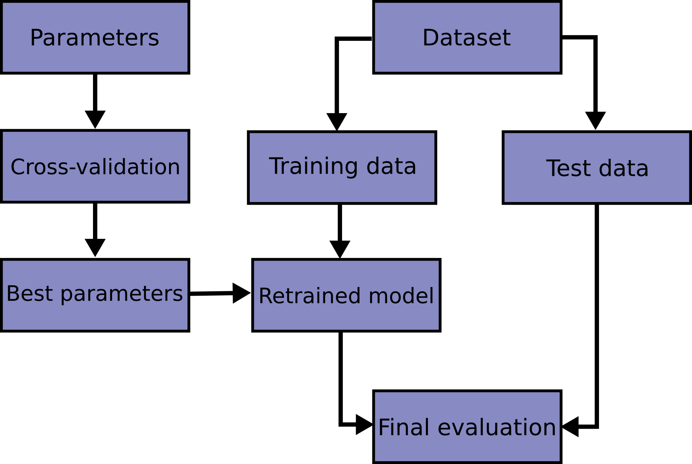
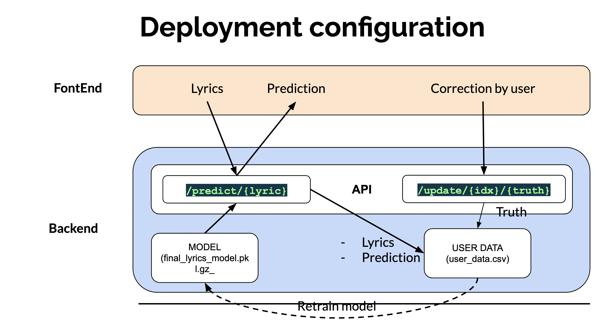
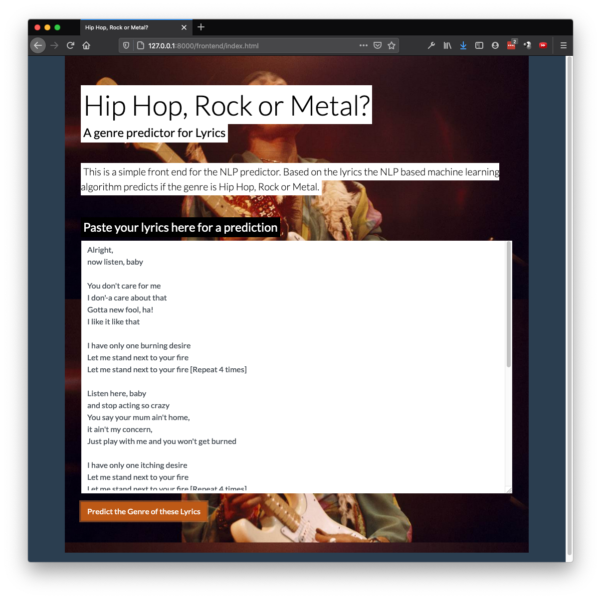
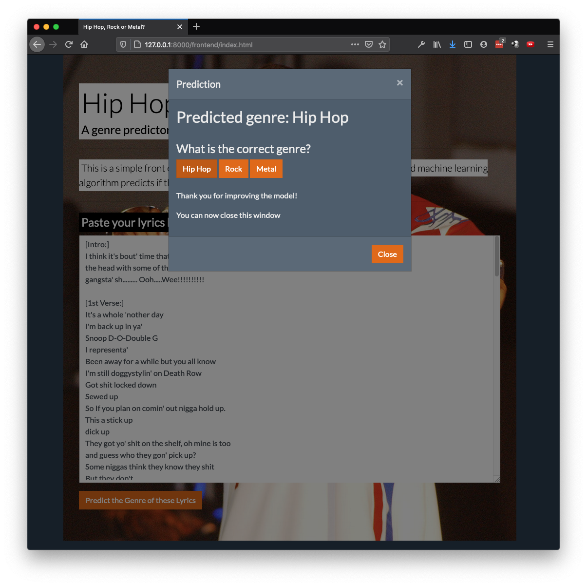

# Introduction

Can we use Natural Language Processing for determining the genre of a song, just by looking at the lyrics? We all have our ideas about genres and what the topics are they are singing about. Pop songs are about love, Hip Hop about gold, money and women, punk about youth and angry words against the current status quo and hard rock is all about fantasy stories. Let’s see if we can use computer analytics on the lyrics of the song to determine this true or even possible. 

## Research question

> Can we predict the genre of a song by analyzing the song lyrics, and what is the quality of that prediction?

This will not be an easy task. We need the computer to interpret the lyrics, find patterns and make a prediction. The genres will not always be clearly defined and neither are the topics. Pop songs can be about politics. And there are multiple hard rock songs about love. The question is, can a computer make that distinction? 

Determining the genre may not even  be the most important goal of the research. It would be interesting to see if we can determine the artist by the lyrics of the  song. Or if we bring the idea further: is this song an original or is there some copyright infringement.  These more elaborate research questions are very interesting, but the datasets for this are not readily available. Or the datasets are too small. Determining the artist of a song is hard problem:

- One artist does have relatively a few songs 
- There a many artist
- Songs are not always originals, but may be a cover.

The setup for this project can be used to explore the initial prediction of a limited set. If the method is predicting well, the knowledge or software can be transferred to more complex data predictions: more genres or one of the other ideas mentioned above. Fail Fast. Fail Often. We need to know if the method is feasible before we start with more complex options.

## Code 

Code can be found in this repository: 

[https://github.com/erikbuunk/ismt-s117-final-project.git](https://github.com/erikbuunk/ismt-s117-final-project.git)

## Note to the graders

If you want to run parts of the code:

- Use the `\notebooks_small` notebooks, you can use this on COLAB and place the data files in the root of the project. (Notebook 2 for Data Exploration and Notebook 5 for Prediction Modeling)
- Run the deployment in the `/deployment` directory

This write up follows the notebooks of `\notebooks`

# Datasets

## Primary dataset: Artists & Lyrics

The following primary dataset will has been used:
https://www.kaggle.com/neisse/scrapped-lyrics-from-6-genres

**This dataset contains:**

- Artist information Information about almost 3000 artists, with labeled genres, number of songs, Link (to directory in the website). This Link will be used to link to the lyrics CSV (`artist-data.csv`)
- Dataset with Lyrics  with over 200,000 lyrics. Fields: Link, songname, lyrics, language. (`lyrics-data.csv`)

That the artists are pre-labeled with genres and the lyrics are already scraped from the web.

## Additional dataset: Metal lyrics

The initial results were not that good. I have decided to add another dataset from Kaggle with Metal lyrics (over 220k songs):

[https://www.kaggle.com/markkorvin/large-metal-lyrics-archive-228k-songs](https://www.kaggle.com/markkorvin/large-metal-lyrics-archive-228k-songs)

From this complete set a smaller sample was created.

# Exploratory analyses

The following exploratory analysis were performed (`01_Data Exploration.ipynb`):

- Check distribution of the data. (genres, artists, lyrics, languages)
- Data analysis: is the data usable, what needs to be cleaned. Visual inspection.
- Top words, word counts leading to a basic tokenizer.
- Word counts/TFIDF
- Cosine similarity between document genres. 
- Create a base pipeline,

## Artists & Lyrics

Not the whole dataset has been used. There are English songs (55%), but also Portuguese, Spanish and others  in there. I will focus on the English songs. 

The genres are not equally distributed over the dataset. The majority of the artists are: Pop (37%), Rock (37%) Hip Hop  (25%) (excluding the other genres) . This resulted in a distribution of the lyrics of around 50% for Rock, 35% Pop and 17% HipHop. 

During the initial exploration I have decided which opereations were neccesary to clean the data. 

## Metal

The data set was created with a directory crawler and contained many lyrics (50k records). Some data cleaning was needed (empty values, Instrumental songs removed, stripping of leading and trailing spaces. 

The dataset was some times messier than the other dataset: different languages, weird spacing that could not be easily removed.

## Combined dataset
The different sources were combined to create one large dataset of about 128k records. 

The metal dataset was added later, so the inital data exploration was done with the lyrics/artist dataset.

## Top Words

With a simple tokenizer the top word were determined. Common words were: `don('t), like, know, love, just, oh, 'll, yeah, let, baby, time, want, wanna, girl, night`. (Excluding very common words and stop words)

## Word counts and Tokenizer.

I have started with a simple tokenizer (lemmas and alpha numerical) and a regular count vectorizer.

## Cosine similarities

Within genre similarities: between .19 and .24. Hip hop is the most similar. From the intial dataset (without metal lyrics) 

```

Hip Hop - Hip Hop
0.24765970212980423
Rock - Rock
0.2110855129121092
Pop - Pop
0.1913122770773068
```


Between genre similarities range was also between .19, .21 so not a lot of difference with the within genre, on the lyrics.Only Hip Hop lyrics seem to be a bit more similar than Rock or Pop. (Note: due to data set changes, the number in the notebook differ form these number, but these are the number on which I made my decisions. Reproducibility is whole other topic, I learned...) I have included the original number in the markdown notes.

Adding the metal dataset, and leaving out the Pop data set (because it was close to Rock)

## Topic Modeller

I have used NMF and LDA as topic modellers. Most of the topic are pretty generic. 

Some signaled non-English and there fore errors in the cleanup of the data:

> la, da, say, que, y, n, sing, el, en, wanna

Most interesting topic is probably for Hip Hop, which I will:

>like, n\*\*, b\*\*ch, f\*\*k, sh\*t, girl, money, n\*\*s, make, feel

Others were more about sex:

> oh, ooh, ah, whoa, night, da, uh, feel, good, body

Pretty clear what the songs are about, I would say


## Initial baseline performance

The initial baseline for Pop, Rock and Hip Hop was very poor, around 60%. Adding metal to the dataset and removing Pop resulted in a performance of 82%. I chose to continue with this data set, with realizing that the performance was probably too optimistic. In a real word application, this part would probably be more iteration on optimizing and cleaning dataset. 

I have created a smaller dataset to check if the results were stable, and they were reasonably close. 

## Optimizing tokenizer, Topic Modeller.

I have experimented with multiple setting for the tokenizer. (alpha, removing digits, removing puntuation, removing urls, emails and single characters). Mainly to make sure the additional texts in the lyrics were not included. The more elaborate tokenizer, however, did not perform better. 

Working with TDIDF or LDA techniques did not improve the performance.

The number of topics was optimized for different dataset and number of genres. 




## BERT tokens

Finally I used to the lyrics to create BERT tokens. This resulted in the best performance with the dataset. (almost 90% on the validation set). (Note: In the notebook the dataset has changed and the tokens need to be regenerated on the dataset.)

# Methodology

The BERT vectors were the best feature/vector representation of the data. Within one data set or choice of genres, the difference between different dataset were really small. 

Data is very similar and ofthe messy, with meta-data such as [CHORUS], Repeat, Guitar TABS etc. Some parts can be cleaned other thing were difficult.

The document level BERT embedding will need to be generated on Colab with GPU. These embeddings will be used in the same classifier as. 

The selecting the best classifier was the last step in the process

**Feature creation:**

- Combinstation and cleaning of data (`02_DataPrep.ipynb`)
- Creating of the BERT vectors (`03_BERT_token_COLAB.ipynb`)
- Combining of the data set and the Bert Vectors (`04_DataPrep_2.ipynb`)

**Prediction model:**

- selection and optimizing the model `05_model.ipynb`

The reason to split up the notebooks was that the notebooks were too long. And a lot of information was not needed in these steps. The BERT vector generation took al over 3 hours for the large data set and could only be done on Colab with GPU. The idea was to create a large dataset one time so the long calculations of the BERT vectors need only be done once. (For submitting the project is was not the best choice)




## Feature creation
What was leared from the exploration was put into a pipeline. The feature are create in notebooks 2-4. First data is cleaned, combined. Data is save to `df_total_cleaned`

The second part is the BERT vector creation. To be done with COLAB, and GPU. (Takes around 4 hours). Tokens are saved to `lyrics_bert_vectors_total.pkl.gz`

The last notebook combines the 2 data sets to one large dataset with all the BERT vectors. The final genres are chosen here. Also a balanced subset is created (equally distributed genres). In this notebook there is an options to select the data set to be used (12k for my project) and the genres (Rock Metal and Hip Hop)

Also the training and test set are created with a 70/30 split.

The result is stored in 4 pickle files.

## Model selection

Notebook 5 (`05_model.ipynb`)

This following image is  from Scikit learn [1]  and is a guideline to which model to use. 


We are dealing with a classification and we have a lot of data available (at least 12000 records up to 150,000). We are working with Text Data.

### Linear SVC - The baseline

92% accuracy wich is very good. Looking at the confusion matrix it shows a pattern:

```
         Hip Hop  Metal  Rock
Hip Hop      747      0    93
Metal          0    840     0
Rock          99      4   737
```


Metal is almost perfectly categorized. I assumed that language and other pattern probably were the cause. But we so much data is very difficult to assess what the real cause is. 

Look at the BERT vectors does not tell you anything. And looking at the wrongly classified lyrics does not reveal a pattern:

```
Truth - predicted
------------------------------
Hip Hop - Rock
------------------------------
6121      previously on ashanti "always there when you c...
19946     Before I get started. polo this beat is retart...
126819    Patrz   w siebie i widz   coraz mniej Powoli p...
33512     Fatjoe: TS. Thalía: Hey baby. Fatjoe: Yeah. Th...
126051    I felt the ground start to shake  Oh God  oh G...

(...)

------------------------------
Rock - Metal
------------------------------
61016     Willing and waitng.... But it's all up to you....
103961    He breaks me down. He builds me up. He fills m...
122080    When I get to the bottom I go back to the top ...
142066    Forever seems so far  Forever seems so cold  F...
```

Other metrics:
```
              precision    recall  f1-score   support

     Hip Hop       0.88      0.89      0.89       840
        Rock       1.00      1.00      1.00       840
       Metal       0.89      0.88      0.88       840

    accuracy                           0.92      2520
   macro avg       0.92      0.92      0.92      2520
weighted avg       0.92      0.92      0.92      2520

```
All very high values.

The main goal with the model selection is trying different models and different hyper parameters to determine the simpelest model, with the best possible performance. So with a similare performance the simpelest model will be chosen.

### SVC, multiple kernels (radial, polynomial, linear, sigmoid)
The result were very close. The best result RBF, with C=5 value. It improved the validation accuracy to about 94%. Other performed less or equal. 

### Other models

- Stochastic gradient descent  (SGD) (65% accuracy) - Either not enough data or the requirements for the model are not met (assumption of normal distributed data). 
- KNeighborsClassifier (89% accuracy)
- Naive Bayes (90%)
- Neural network (94%), multiple configurations tried (more/less hidden layers and sizes of the hidden layer. The (500, 500) size hidden layer performed the best. 


## Model Tuning

Model tuning is done by a grid search where parameters are tuned. The training set is used for a smaller training and a validation set. In the grid search the smaller training set is used with crossvalidation. The results were checked with the validation set.

In the end the best model is evaluated with the test data set. The process as described by SciKit learn is used [2]. 





## Final evaluation

The complete training set was used to train the SVC model and radial kernel and the test set was used for final evaluation. The final model (`final_lyrics_model.pkl.gz`) was saved for the deployment.

The final accuracy was 95% with the following confusion matrix for the test set:

```
         Hip Hop  Metal  Rock
Hip Hop     1063      0   137
Metal          0   1200     0
Rock          57      1  1142
```


```
              precision    recall  f1-score   support

     Hip Hop       0.95      0.89      0.92      1200
        Rock       1.00      1.00      1.00      1200
       Metal       0.89      0.95      0.92      1200

    accuracy                           0.95      3600
   macro avg       0.95      0.95      0.95      3600
weighted avg       0.95      0.95      0.95      3600
```


Althoug the results look really promising on the test set, the model seems stable and performing well. I think there is a strong bias. Mainly in the selection of the dataset (leaving Pop out) and the Metal lyrics are almost cerntainly having a strong bias as well with the almost perfect prediction. With this much text data is very challenging to get a grasp of where things go wrong, and that is one of learnings here. 

For a real world implementation this would be a reason not to go live. But for this project it nice spend some time on the final deployment and user interface. 

# Deployment strategy


The deployment looks as follows:

- `FrontEnd` is a website. Here the user can enter lyrics and get the prediction. After the prediction is returned the user can correct the answer by selection the right genre. (directory `deployment/frontend`)
- `Backend` is a simple `Fast API` Python backend with 2 endpoints. One is for getting the prediction. It uses the generated model, generated the BERT vector for the lyrics. It returns the model prediction. The lyrics are written to a CSV file so it can later be used for retraining. If the user clicks the correct genre, this value is stored in the csv as well. (`deployment/model_api.py). 
- There is also file that can be used for retraining the model (`retrain_model.py`). This uses the complete dataset with BERT tokens and could be used to include the `user_lyrics_data.csv` data. In this version retraining works (for example using a different genre set), but the addition of the user data does not.



## Screenshots of the Front End



Here you can enter the lyrics. Click on the button to get a prediction



Here the you can click on the the correct genre, so this data can be used for improvement of the model.

## Deployment instructions

### Prerequisites:

The following needs to be installed on the local machine:

- Python 3
- Git

### Installation

Clone the project :

```bash
git clone https://github.com/erikbuunk/ismt-s117-final-project.git
```

There are 3 directories:

- `/deployment`: front and back end code. The main files:
  - `model_api.py`: The backend for the API. This part also servers the webpage in `./frontend`
  - `retrain_model.py`: Code to retrain the model. (The updated user data is not used, since this needs to be manually checked.)
- `/documentation`: files for documentation 
- `/notebooks`: all the notebooks
  - `00_Data_Reduction_Scripts.ipynb`: Prepatory files for filesize reduction
  - `01_Data Exploration.ipynb`: Initial data exploration.
  - `02_DataPrep.ipynb`: Data preparation part 1
  - `03_BERT_token_COLAB.ipynb`: Notebook to generate the BERT tokens
  - `04_DataPrep_2.ipynb`: Notebook to combine the data
  - `05_Model.ipynb`: Notebook for determining the model selection and training of the final model
  - `06_Final_Workflow.ipynb`: Helper notebook. The code for this is used in the `model_api.py` for the deployment

`pip install` the following libraries, or use the `requirements.txt`:

```
fastapi
uvicorn
aiofiles
transformers
torch
```

### Running the demo

Run the website and the backend API:
```
cd deployment
uvicorn model_api:app
```

It will show on what port the website will run. In most case this will be port 8000. 
Open the browser and go to:

```
http://127.0.0.1:8000/frontend/index.html
```


# References
Scikit Learn documentation:

[1] https://scikit-learn.org/stable/tutorial/machine_learning_map/index.html

[2]https://scikit-learn.org/stable/modules/cross_validation.html

