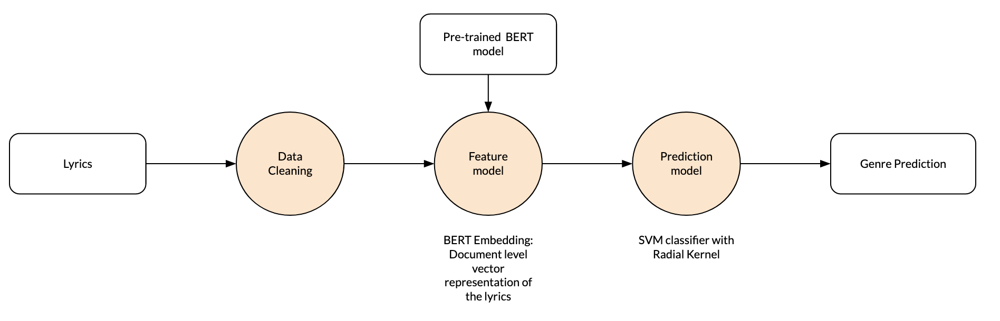

# Introduction

Can we use Natural Language Processing for determining the genre of a song, just by looking at the lyrics? We all have our ideas about genres and what the topics are they are singing about. Pop songs are about love, Hip Hop about gold, money, and women, punk about youth and angry words against the current status quo, and hard rock is all about fantasy stories. Let’s see if we can use computer analytics on the lyrics of the song to determine this true or even possible. 

## Research question

> Can we predict the genre of a song by analyzing the song lyrics, and what is the quality of that prediction?

This will not be an easy task. We need the computer to interpret the lyrics, find patterns, and make a prediction. The genres will not always be clearly defined and neither are the topics. Pop songs can be about politics. And there are multiple hard rock songs about love. The question is, can a computer make that distinction? 

Determining the genre may not even be the most important goal of the research. It would be interesting to see if we can determine the artist by the lyrics of the song. Or if we bring the idea further: is this song an original or is there some copyright infringement.  These more elaborate research questions are very interesting, but the datasets for this are not readily available. Or the datasets are too small. Determining the artist of a song is a hard problem:

- One artist does have relatively a few songs 
- There a many artists
- Songs are not always originals but may be a cover.

The setup for this project can be used to explore the initial prediction of a limited set. If the method is predicting well, the knowledge or software can be transferred to more complex data predictions: more genres or one of the other ideas mentioned above. 

## Code 

Code can be found in this repository: 

[https://github.com/erikbuunk/ismt-s117-final-project.git](https://github.com/erikbuunk/ismt-s117-final-project.git)

## Note to the graders

If you want to run parts of the code:

- Use the `\notebooks_small` notebooks, you can use this on COLAB and place the data files in the root of the project. (Notebook 2 for Data Exploration and Notebook 5 for Prediction Modeling)
- And please run the deployment in the `/deployment` directory. Instructions are in the Deployment section of this document.

This write up follows the notebooks of `\notebooks`

# Datasets

## Primary dataset: Artists & Lyrics

The following primary dataset that has been used:  https://www.kaggle.com/neisse/scrapped-lyrics-from-6-genres

**This dataset contains:**

- Artist information Information about almost 3000 artists, with labeled genres, the number of songs, a link (to the directory on the website). This link-field will be used to link to the lyrics CSV (`artist-data.csv`)
- A dataset with Lyrics with over 200,000 lyrics. Fields: link, song name, lyrics, language. (`lyrics-data.csv`)

That the artists are pre-labeled with genres and the lyrics are already scraped from the web.

## Additional dataset: Metal lyrics

The initial results were not that good. I have decided to add another dataset from Kaggle with Metal lyrics (over 220k songs):

[https://www.kaggle.com/markkorvin/large-metal-lyrics-archive-228k-songs](https://www.kaggle.com/markkorvin/large-metal-lyrics-archive-228k-songs)

From this complete set, a smaller sample was created.

# Exploratory analyses

The following exploratory analyses were performed (`01_Data Exploration.ipynb`):

- Check the distribution of the data. (genres, artists, lyrics, languages)
- Data analysis: is the data usable, what needs to be cleaned. Visual inspection.
- Top words, word counts leading to a basic tokenizer.
- Word counts/TF-IDF
- Cosine similarity between document genres. 
- Create a base pipeline

## Artists & Lyrics

Not the whole dataset was used. There are English songs (55%), but also Portuguese, Spanish, and others were in there. The project focused on lyrics in English. 

The genres were not equally distributed over the dataset. The majority of the artists are Pop (37%), Rock (37%) Hip Hop  (25%) (excluding the other genres). This resulted in a distribution of the lyrics of around 50% for Rock, 35% Pop, and 17% Hip Hop. 

During the initial exploration, I have decided which operations were necessary to clean the data. 

## Metal

The data set was created with a directory crawler and contained many lyrics (50k records). Some data cleaning was needed (empty values, Instrumental songs removed, stripping of leading and trailing spaces. T

The dataset was some times messier than the other dataset: different languages, weird spacing that could not be easily removed. 

## Combined dataset

The different sources were combined to create one large dataset of about 128k records. 

The metal dataset was added later, so the initial data exploration was done with the lyrics/artist dataset. he number of metal lyrics that were added to the previous data set was more or less arbitrary. There is no knows relationship to the actual distribution of the lyrics population. 

## Word counts and Tokenizer.

The first step is to look at the data and to get the top words from the corpus. NLP uses a count vectorizer for this purpose. It is up to the user to determine how words are split (most of the time white space). But also what is important to keep or throw away.  I have started with a simple tokenizer (lemmas and only alphanumerical characters) and a regular count vectorizer. With this method, a vocabulary is built that can be used for further exploration or dimensionality reduction. 
The term frequency-inverse document frequency (TF-IDF) has also been used. Instead of just counting the words in each document, the words are weighted. If words are unique to a smaller set of documents, the word gets a higher weight. 


## Top Words

With the simple tokenizer, the top words were determined. Common words were: `don('t), like, know, love, just, oh, 'll, yeah, let, baby, time, want, wanna, girl, night`. (Excluding very common words and stop words). The corpus is very different from regular text and very specific to modern song lyrics. 

## Cosine similarities

With the word counts or the weighted TF-IDF, we have document vectors. The vectors can be used to compare the lyrics. The cosine similarity measure can be used for this. If documents are similar and have many words in common, the cosine similarity (or dot product between the two vectors) will be close to 1. If they are different the value will be closer to 0. One would expect that lyrics of the same genre may have a higher value than the lyrics of a different genre. 

The `within genre` similarities: between .19 and .24. Hip hop is the most similar. The results from the initial dataset (without metal lyrics which were added later): 

```

Hip Hop - Hip Hop
0.24765970212980423
Rock - Rock
0.2110855129121092
Pop - Pop
0.1913122770773068
```

The `between-genre` similarities range was also between .19, .21 so not a lot of difference with the within genre, on the lyrics. Only Hip Hop lyrics seem to be a bit more similar than Rock or Pop. (Note: due to data set changes, the number in the notebook differ from these numbers, but these are the number on which I made my decisions. Reproducibility is whole other topic, I learned...) I have included the original numbers in the markdown notes of the Jupyter notebook.


## Topic Modeler

Topic Modelers are algorithms that use the word counts/TD-IDF vectors to reduce the number of dimensions (length of the vocabulary) to a lower number, for example, 10, topics. It is an unsupervised approach. Non-negative Matrix Factorization (NMF) is a Linear-algebraic model and Latent Derelicht Analysis is a probabilistic model. The type of results of the models are basically the same, the way to get there is different. 

Most of the topics that the algorithms found were very generic for all the lyrics. A few very spot on, but more in terms of topic, than in specific for a genre. 

The most interesting topic is probably for Hip Hop, (which I will censor):

>like, n\*\*, b\*\*ch, f\*\*k, sh\*t, girl, money, n\*\*s, make, feel

Others were more about sex:

> oh, ooh, ah, whoa, night, da, uh, feel, good, body

Pretty clear what the songs are about, I would say

Some signaled non-English words and therefore errors in the cleanup of the data:

> la, da, say, que, y, n, sing, el, en, wanna


## Initial baseline performance

The goal was to come to a prediction model. After the initial exploration, a baseline for the prediction was determined. 

The initial baseline for Pop, Rock, and Hip Hop was very poor, around 60% accuracy. Adding Metal to the dataset and removing Pop resulted in a performance of 82%. I chose to continue with this data set, with realizing that the performance was probably too optimistic. In a real-world application, I would choose for spending more time optimizing and cleaning the dataset. 

I have created a smaller dataset to check if the results were stable, and they were reasonably close.

## Optimizing tokenizer, Topic Modeller.

The next step in the exploration was to dive deeper into the setting of the tokenizer, a choose different settings: alpha, removing digits, removing punctuation, removing URLs, emails, and single characters. The main goal here is to make sure the non-informative texts in the lyrics were not included. A more elaborate tokenizer did, however, did not perform better. The prediction did get better, but also the topic modelers were not improving. 

The number of topics was optimized for different datasets and several combinations of genres. De topic modeling vector could be optimized, but this didn't improve the accuracy much compared to the baseline.


## BERT tokens
BERT (Bidirectional Encoder Representations from Transformers)) makes use of Transformers and attention mechanisms to capture contextual information of the text. The attention mechanism looks at different parts of the text to find relationships within the text. 

BERT has been trained on very large corpora and can be used in transfer learning, similar to how that is done with images. The nice thing here is that the largest part of the learning is already done and that that trained model can be used to fine-tune the next step. In this case, the knowledge of the pre-trained model is used to create a document-level representation of the level. This is probably one of the easiest ways of creating context-aware document representation. For this project, the BERT base model is used. 

The use of  BERT tokens for the lyrics resulted immediately in a huge increase in performance (around 90% on the validation set compared to 82%). (Note: In the notebook, the dataset has changed and the tokens need to be regenerated on the dataset.)

## Base pipeline
The pipeline for the project was as follows:
1. Lyrics are cleaned
2. Document embedding as created with BERT
3. The BERT vectors as input for a prediction model

The collection of notebooks mirrors this setup. 

# Methodology

Based on the pipeline. Step 1 is the cleaning of the data. 
Data is very similar and of the messy, with meta-data such as: [CHORUS], Repeat, Guitar TABS, etc. Some parts can be cleaned other things were difficult. Were possible foreign language lyrics were removed. 

The BERT vectors were the best feature/vector representation of the data according to the prediction performance.

Selecting the best classifier was the last step in the process

**Feature creation:**

- Combination and cleaning of data (`02_DataPrep.ipynb`)
- Creation of the BERT vectors (`03_BERT_token_COLAB.ipynb`)
- Combining of the data set and the Bert Vectors (`04_DataPrep_2.ipynb`)

**Prediction model:**

- selection and optimizing the model `05_model.ipynb`

The reason to split up the notebooks was that the notebooks were too long. And a lot of information was not needed in these steps. The BERT vector generation took al over 3 hours for the large data set and could only be done on Colab with GPU. The idea was to create a large dataset one time so the long calculations of the BERT vectors need only be done once. (For submitting the project is was not the best choice)


## Feature creation
What was learned from the exploration was put into the pipeline. The features are created in notebooks 2 to 4. First data is cleaned, the datasets combined. The data is saved to `df_total_cleaned`

The second part is the creation of BERT-vectors. This was done on Google Colaboratory (Colab), with the use of GPU, and Takes around 4 hours. Tokens are saved to `lyrics_bert_vectors_total.pkl.gz`

The last notebook combines the 2 data sets to one large dataset including all the BERT vectors. The final genres are chosen here. Also, a balanced subset is created (equally distributed genres). In this notebook, there is an option to select the data set to be used (12k for my project) and the genres (Rock, Metal, and Hip Hop). Since the underlying distribution of genres is unknown, deskewing the dataset seemed the most sensible thing to do.

The training and test sets are created with a 70/30 split. And finally, the resulting data is stored in 4 pickle files.

## Model selection

Notebook 5 (`05_model.ipynb`) is all about trying different prediction models and tuning the hyperparameters. 

The following image is from Scikit learn [1]  and is a guideline to which model to use. It was a good starting point. 


In this problem set, we are dealing with a (supervised) classification and we have a lot of data available (at least 12000 records, but up to 150,000 is available). We are working with Text Data.

### Linear SVC - The baseline

92% accuracy wich is very good. Looking at the confusion matrix of the validation set it shows a pattern:

```
         Hip Hop  Metal  Rock
Hip Hop      747      0    93
Metal          0    840     0
Rock          99      4   737
```

Metal is almost perfectly categorized. I assumed that language and other patterns probably were the cause. But we so much data is very difficult to assess what the real cause is. But there is a strong bias in the data set. 

Looking at the BERT vectors does not tell you anything, where this bias comes from. And looking at the wrongly classified lyrics does not reveal a pattern either:

```
Truth - predicted
------------------------------
Hip Hop - Rock
------------------------------
6121      previously on ashanti "always there when you c...
19946     Before I get started. polo this beat is retart...
126819    Patrz   w siebie i widz   coraz mniej Powoli p...
33512     Fatjoe: TS. Thalía: Hey baby. Fatjoe: Yeah. Th...
126051    I felt the ground start to shake  Oh God  oh G...

(...)

------------------------------
Rock - Metal
------------------------------
61016     Willing and waitng.... But it's all up to you....
103961    He breaks me down. He builds me up. He fills m...
122080    When I get to the bottom I go back to the top ...
142066    Forever seems so far  Forever seems so cold  F...
```

Other metrics:
```
              precision    recall  f1-score   support

     Hip Hop       0.88      0.89      0.89       840
        Rock       1.00      1.00      1.00       840
       Metal       0.89      0.88      0.88       840

    accuracy                           0.92      2520
   macro avg       0.92      0.92      0.92      2520
weighted avg       0.92      0.92      0.92      2520

```
All very high values. And maybe these high scores should be a red flag.

The main goal with the model selection is trying different models and different hyperparameters to determine the simplest model, with the best possible performance. So with a similar performance, the simplest model will be chosen.

### SVC, multiple kernels (radial, polynomial, linear, sigmoid)
The baseline was determined with a linear Support Vector Classifier. This method tries to separate the data points with the largest possible margin between the groups. The hyperparameters determine how rigid the model is. Next to the linear model, various other kernels can be used. These determine how the boundary looks like. 


### Other models
 
- Stochastic gradient descent  (SGD) (65% accuracy) - Either not enough data or the requirements for the model are not met (assumption of normally distributed data). 
- K-NeighborsClassifier (89% accuracy)
- Naive Bayes (90%)
- Neural network (94%), multiple configurations tried (more/less hidden layers and sizes of the hidden layer. The (500, 500) size hidden layer performed the best. 


## Model Tuning

Model tuning is done by a grid search where parameters are tuned with the training data (All combinations of the parameters are assessed, and Cross-Validation is used to check the stability of the values). The results were checked with the validation set.

The results with different parameters and models are often very close. The best result was the SVC with RBF (Radial) kernel, with C=5 value. It improved the validation accuracy to about 94%. Others performed less or equal. 


## Final evaluation

The complete training set was used to train the SVC model and radial kernel and the test set was used for final evaluation. The final model (`final_lyrics_model.pkl.gz`) was saved for the deployment.

The final accuracy was 95% with the following confusion matrix for the test set, so it was even a little higher than the training set :

```
         Hip Hop  Metal  Rock
Hip Hop     1063      0   137
Metal          0   1200     0
Rock          57      1  1142
```


The final results were very similar to the previous results. 

```
              precision    recall  f1-score   support

     Hip Hop       0.95      0.89      0.92      1200
        Rock       1.00      1.00      1.00      1200
       Metal       0.89      0.95      0.92      1200

    accuracy                           0.95      3600
   macro avg       0.95      0.95      0.95      3600
weighted avg       0.95      0.95      0.95      3600
```

The final pipeline of looks as follows: First the Lyrics are cleaned (such as trimming, removing of metadata in brackets). After this, the pre-trained BERT model is used to create a document-level vector representation of the lyrics. This vector representation is used in a Support Vector Classifier with a radial kernel. From here we get a genre prediction for the lyrics.


## Discussion

The results look really promising on the test set, the model seems stable and performing well. I think there is a strong bias in the data. Mainly in the selection of the dataset (leaving Pop out) and the Metal lyrics are almost certainly having a strong bias as well with the almost perfect prediction. With this much data, it is very challenging to get a grasp of where things go wrong, and that is one of the learnings here. Since the number of documents is soo large, and you cannot interpret the BERT vectors, you are in the dark looking for a solution. 

Testing with the deployment and entering lyrics, leads to much, much lower accuracy. 

For a real-world implementation this would a red flag and a reason not to go live. But for this project, it nice spend some time on the final deployment and user interface. 

### Conclusions

- In practice, the accuracy is much lower. My guess is the Metal dataset.
- Changes in dataset selection have more effect on the results than any chosen model or parameter choice.
- Topic-wise lyrics are skewed, many songs about love, relationships. This makes it harder to distinguish
- Bigger is not better in this case. The dataset is very large, but having more data doesn't lead to improvements in the results. The quality of the dataset is more important.
- Use a test dataset from a different source. 


### Improvements & Ideas
There are several ways to improve. Here are a couple suggestions.
- Spend more time on the selection and cleaning of the documents. If the source is not good, the results will not be good.
- Looking for clean genre lyrics. Many artists fall in multiple genre categories
- Use the topic modelers for what their main purpose is: look for topics of lyrics, not for genres. They may be better for categorizing what the songs are about than about the genre
- BERT is trained on generic data set. It may be an idea to train BERT on lyrics, make sure the dataset is clean, and the result may in practice be better. There are many lyrics available so that will not be a limitation.
- Try to create an automated lyrics songwriter. 
- Predict the artist (or writer) of the lyrics.

# Deployment strategy


The deployment looks as follows:

- `FrontEnd` is a website. Here the user can enter lyrics and get the prediction. After the prediction is returned the user can correct the answer by selecting the right genre. (directory `deployment/frontend`)
- `Backend` is a simple `Fast API` Python backend with 2 endpoints. One is for getting the prediction. It uses the generated model, generated the BERT vector for the lyrics. It returns the model prediction. The lyrics are written to a CSV file so it can later be used for retraining. If the user clicks the correct genre, this value is stored in the CSV as well. (`deployment/model_api.py). Since only 1 BERT vector has to be generated, the time needed is very limited (around 1 second on a laptop)
- There is also a file that can be used for retraining the model (`retrain_model.py`). This uses the complete dataset with BERT tokens and could be used to include the `user_lyrics_data.csv` data. In this version retraining works (for example, using a different genre set), but the addition of the user data does not. This process could be automated, but since people can enter anything in the text box, the result needs to be reviewed before they are used.


Figure 5 and Figure 6 show the front end of the website. 


In the first screen, the user can enter the lyrics. After a click on the button on the bottom, the prediction is made


In the second screen, the user can click on the correct genre, so this data can be used for the improvement of the model.

## Deployment instructions

### Prerequisites:

The following needs to be installed on the local machine:

- Python 3
- Git

### Installation

Clone the project, and install the Python libraries from the terminal: 

```bash
git clone https://github.com/erikbuunk/ismt-s117-final-project.git
cd ismt-s117-final-project
cd deployment
pip install -r requirements.txt
```

There are 3 directories:

- `/deployment`: front and back end code. The main files:
  - `model_api.py`: The backend for the API. This part also servers the webpage in `./frontend`
  - `retrain_model.py`: Code to retrain the model. (The updated user data is not used, since this needs to be manually checked.)
- `/documentation`: files for documentation 
- `/notebooks`: all the notebooks
  - `00_Data_Reduction_Scripts.ipynb`: Preparatory files for filesize reduction
  - `01_Data Exploration.ipynb`: Initial data exploration.
  - `02_DataPrep.ipynb`: Data preparation part 1. Cleaning and combining data files
  - `03_BERT_token_COLAB.ipynb`: Notebook to generate the BERT tokens
  - `04_DataPrep_2.ipynb`: Data preparation part 1: Notebook to combine data with vectors.
  - `05_Model.ipynb`: Notebook for determining the model selection and training of the final model
  - `06_Final_Workflow.ipynb`: Helper notebook. The code for this is used in the `model_api.py` for the deployment

### Running the demo

Start the website and the backend API from by typing the following command in the deployment directory:

```
uvicorn model_api:app
```
(This may include and additional download. )

It will show on what port the website will run. In most cases, this will be port 8000. 
Open the browser and go to:

```
http://127.0.0.1:8000/frontend/index.html
```


# References

Scikit Learn documentation:

[1] https://scikit-learn.org/stable/tutorial/machine_learning_map/index.html

[2] https://scikit-learn.org/stable/modules/cross_validation.html

